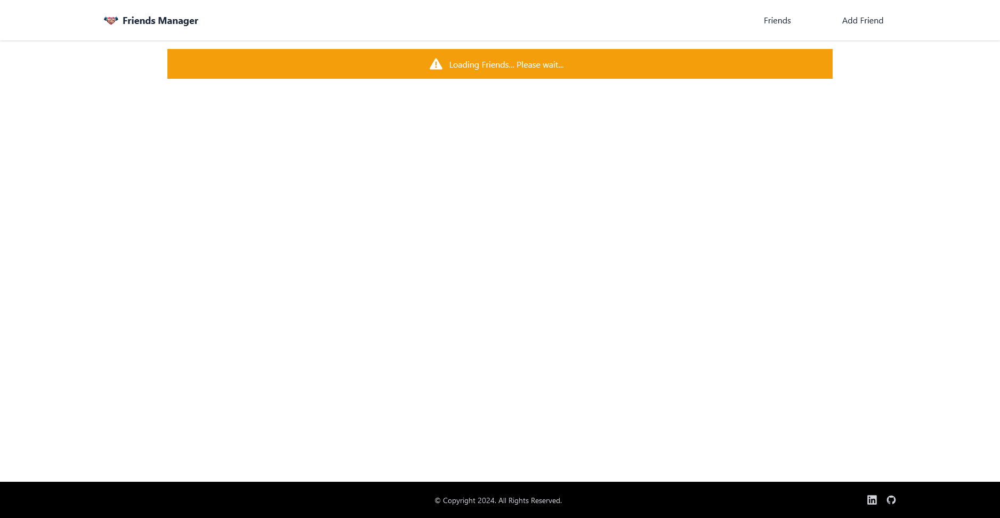
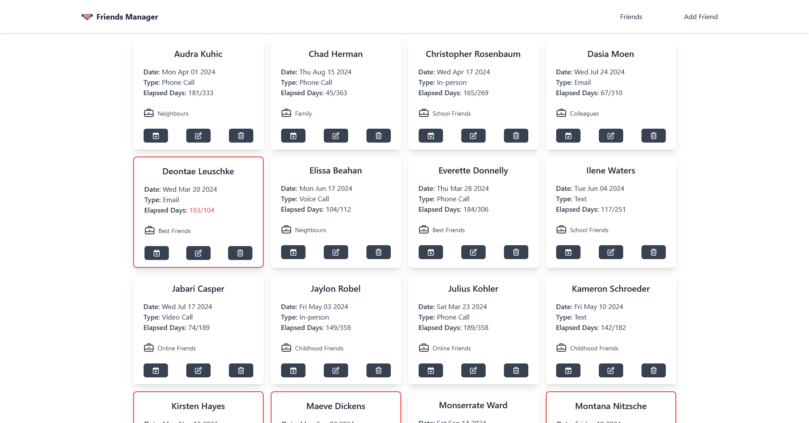
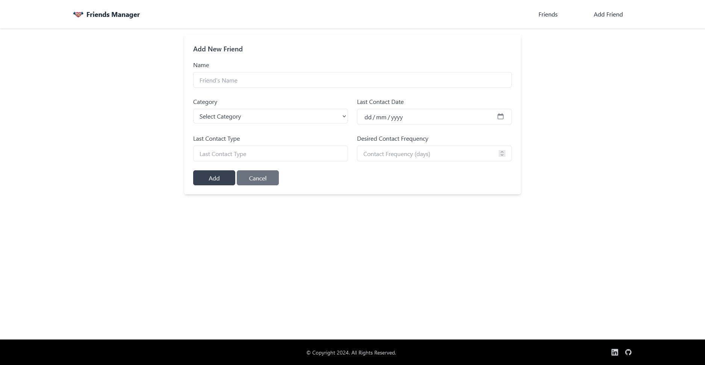
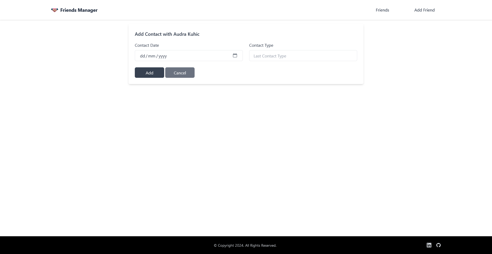
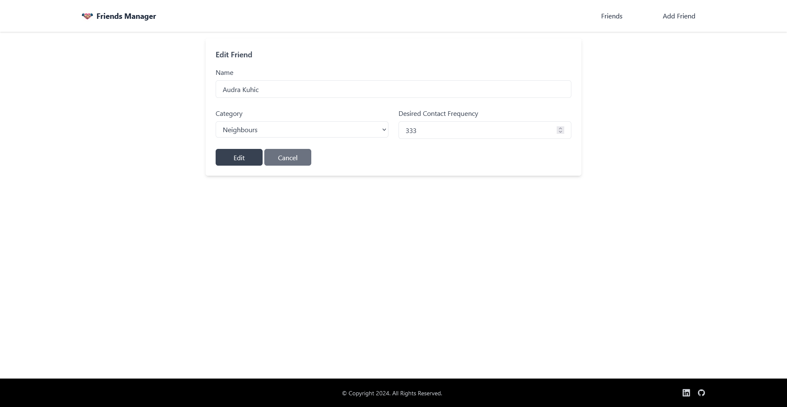
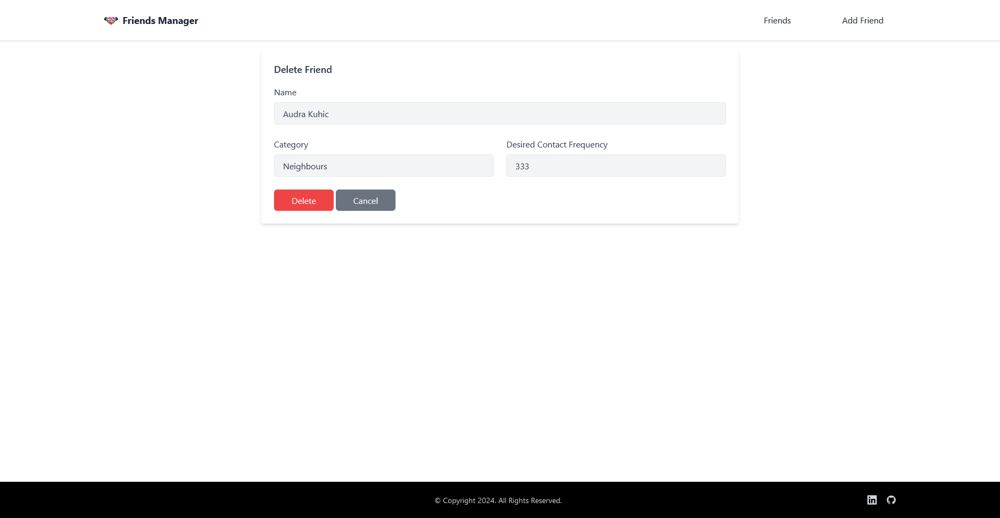
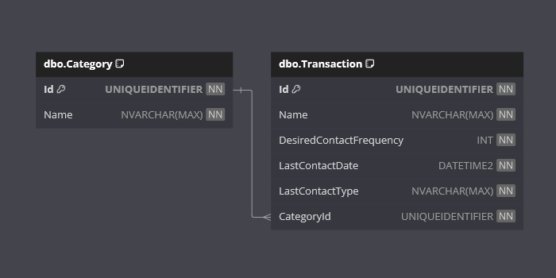

# Friends Manager

Welcome to the **Friends Manager** App!

This is a .NET and React project designed to demonstrate using Redux for handling the state management within the frontend application.

It allows users to manage their friends and see which friends need attention. It uses an external API to perform CRUD operations on a database.

## Requirements

This application fulfills the following [The C# Academy - Friends Manager](https://thecsharpacademy.com/project/38/friends-manager) project requirements:

- [x] In this app you'll keep data about the friendships you want to cultivate.
- [x] You can choose which properties you want to have in your "Friend" model, except that you need to have a "LastContactDate" and a "LastContactType" and a "Desired Contact Frequency" properties
- [x] You're also required to have a "Category" table, which will be linked to your "Friends" table by a foreign key.
- [x] Users should be able to easily visualize the friends that are getting the least attention (i.e. Last contact date has been longer than desired contact frequency)
- [x] When adding a new friend, the form should contain a dropdown with the Category.
- [x] You need to use Redux for state management.
- [x] You need to handle validation and server errors.

## Features

- **Redux**: Redux handles the state managements. It tracks API loading, API errors, and the array of Friends and Categories from the API.
- **Loading**: When the frontend application starts, it will show a Loading Data message.
- **Error**: If there is an error when fetching the api data, it will show an Error message.
- **Main View**: 
	- When the api data has been fetched, a list of Friend Cards will be displayed.
	- Any Friends that have a Last Contact Date which has exceeded the Desired Contact Frequency will be styled to highlight attention is needed.
	- The user can add a new Friend.
	- The user can record a contact with a Friend.
	- The user can edit a Friend.
	- The user can delete a Friend.
- **Responsive Design**: A user-friendly interface designed to work on various devices.
- **API Methods**: Create, Read, Update and Delete methods are exposed within the API application.

## Technologies

- .NET
- React / Redux
- CSS / Tailwind
- JavaScript
- Entity Framework Core
- SQL Server

## Getting Started

**IMPORTANT NOTE**: 

The `InitialCreate` database migration has been created.

On start-up of the **API** application, any required database creation/migrations will be performed.

### Prerequisites

- .NET 8 SDK.
- A code editor like Visual Studio or Visual Studio Code.
- SQL Server.
- SQL Server Management Studio (optional).
- Node.js
- NPM

### Installation

1. Clone the repository:
	- `git clone https://github.com/chrisjamiecarter/friends-manager.git`

2. Navigate to the API project directory:
	- `cd src\FriendsManager.Api`
	
3. Configure the application:
	- Update the connection string in `appsettings.json` if required.
	
4. Build the application using the .NET CLI:
	- `dotnet build`

5. Navigate to the Web project directory:
	- `cd src\FriendsManager.web`

6. Install dependencies:
	- `npm install`

### Running the Application

1. You can run both applications from Visual Studio, using the **Multiple Startup Projects** option and selecting the *.Api and *.web projects.

OR

1. Run the API application using the .NET CLI in the API project directory:
	- `dotnet run`

2. Start the development server in the Web project directory:
	- `npm start`

## Usage

Once the Web application is running:

- Loading Data message will show while API is being called to retrieve Friends and Categories.
- View a list of Friend Cards.
- Add a new Friend.
- Record contact with an existing Friend.
- Edit a Friend.
- Delete a Friend.
- If an Error message is returned, check API is running, check port running on.

### Loading Page

### Friends Manager

### Add Friend

### Add Contact with Friend

### Edit Friend

### Delete Friend

### Error Page

## How It Works

- **Page Display**: This project was bootstrapped via `create-react-app` and uses React to render the components of the web application.
- **State Management**: Redux is used to manage the state within the web application.
- **API Integration**: Fetch is used to call the External API.
- **Data Storage**: A new SQL Server database is created and the required schema is set up at run-time, or an existing database is used if previously created.
- **Data Access**: Interaction with the database is via Entity Framework Core.

## Database

---
***Happy Friends Managing!***
